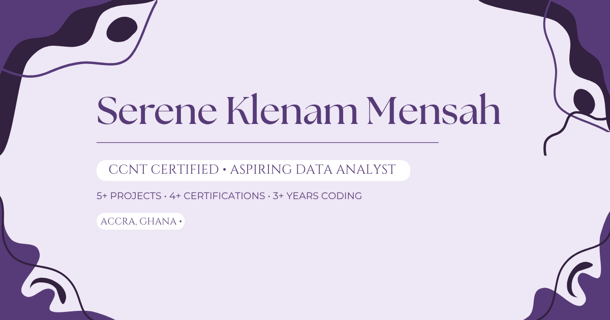

# Serene Klenam Mensah · Personal Portfolio

A personal website for **Serene Klenam Mensah**, a Computer Science student at Ghana Communication Technology University exploring data analysis, networking and cybersecurity.

**[Visit the portfolio](https://sereneklenam-hub.github.io/Portfolio/)** · [Report a bug](https://github.com/SereneKlenam-hub/Portfolio/issues/new?template=bug_report.md)



## About the site

The portfolio presents Serene's story, education, experience, skills, projects and achievements, with direct email and social links. It uses plain HTML, CSS and JavaScript, with no framework, package dependencies or build step.

- Responsive layout and mobile navigation.
- Light and dark themes with a saved preference and system-theme fallback.
- Active section navigation, smooth scrolling and reduced-motion support.
- Accessible labels, keyboard focus states and a skip-to-content link.
- Subtle data-inspired hero visuals and the existing personal photography.
- Canonical, Open Graph and social preview metadata for the live portfolio.

## Run locally

Clone the repository and start a static server from its root:

```sh
git clone https://github.com/SereneKlenam-hub/Portfolio.git
cd Portfolio
python3 -m http.server 8000
```

Open **http://localhost:8000**. Python 3 is only needed for this local server; the website itself runs in a browser. You can also open `index.html` directly, but a server better reflects hosted behaviour.

## Project structure

```text
Portfolio/
├── index.html              # Content, layout, SVG icons and metadata
├── style.css               # Responsive styling, themes and animations
├── script.js               # Theme preferences and navigation behaviour
├── assets/images/
│   ├── serene.JPG          # Serene's profile photograph
│   ├── preview.png         # Social sharing preview
│   └── favicon.svg         # Site favicon
├── .github/                # Issue and pull request templates
├── CONTRIBUTING.md
├── CODE_OF_CONDUCT.md
├── CREDITS.md
├── SECURITY.md
└── LICENSE
```

## Editing and checking

Keep personal content in `index.html`, presentation in `style.css`, and behaviour in `script.js`. Main navigation follows About, Experience, Projects, Achievements and Contact. Education lives within About; Skills lives within Experience. The `#education` and `#skills` anchors remain available for existing links.

Before submitting changes:

```sh
node --check script.js
git diff --check
```

Node.js is optional and only used for the JavaScript syntax check. There is currently no automated test suite or build pipeline. Check the site in a browser at phone, tablet and desktop widths; verify both themes, saved preferences, keyboard navigation, reduced motion, section links and the console.

The project chart is an illustrative visual, not published analysis results. Preserve that distinction when editing it.

## Hosting and metadata

The live portfolio is hosted at **https://sereneklenam-hub.github.io/Portfolio/**. The repository contains a static site ready for GitHub Pages; it does not include a deployment workflow. Repository owners manage publication through their existing Pages configuration.

Keep asset paths relative so they work beneath `/Portfolio/`. If the hosting URL changes, update the canonical URL, `og:url`, and absolute preview image URLs in `index.html` together. The supplied preview is 1200 × 630 pixels.

## Privacy and external services

The site stores the selected theme locally under `serene-theme`. It includes no custom analytics, backend, account system or contact form. Fonts load from Google Fonts; social links open external services. Email and phone links hand off to the visitor's configured applications.

## Ownership and credits

**All portfolio credit belongs to Serene Klenam Mensah.** This is her website, personal story and portfolio. Development contributors provide implementation and maintenance assistance; they are not presented as the portfolio owner or subject. See [CREDITS.md](CREDITS.md).

## License and participation

The website's source code is available under the [MIT License](LICENSE), copyright © 2026 Serene Klenam Mensah. Personal photographs, the preview artwork, identity and biographical content are not offered for reuse under the code license; obtain Serene's permission before reusing them.

See [CONTRIBUTING.md](CONTRIBUTING.md) for contributions, [CODE_OF_CONDUCT.md](CODE_OF_CONDUCT.md) for community expectations and [SECURITY.md](SECURITY.md) for private security reporting.
